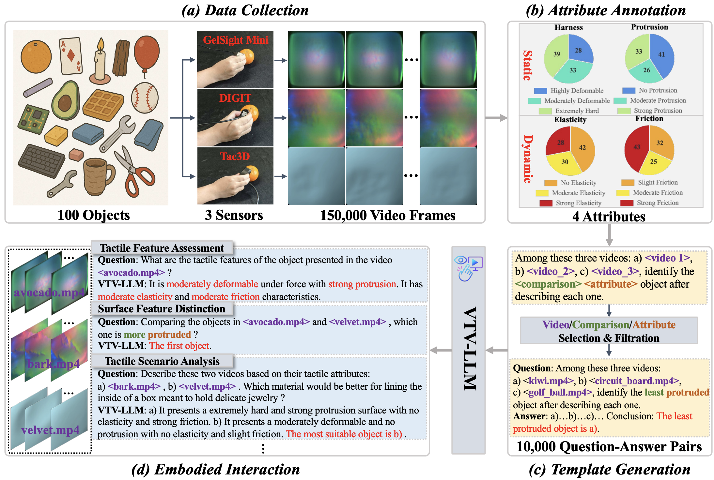
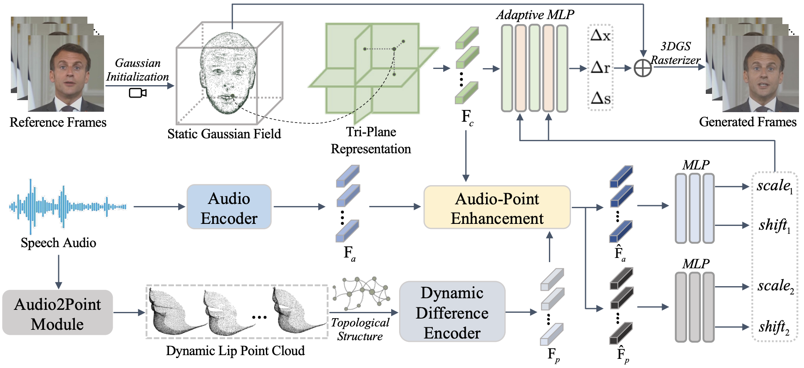
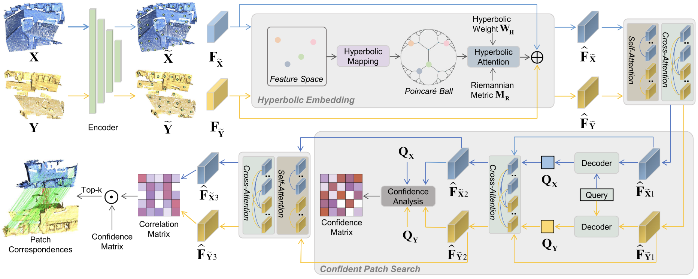
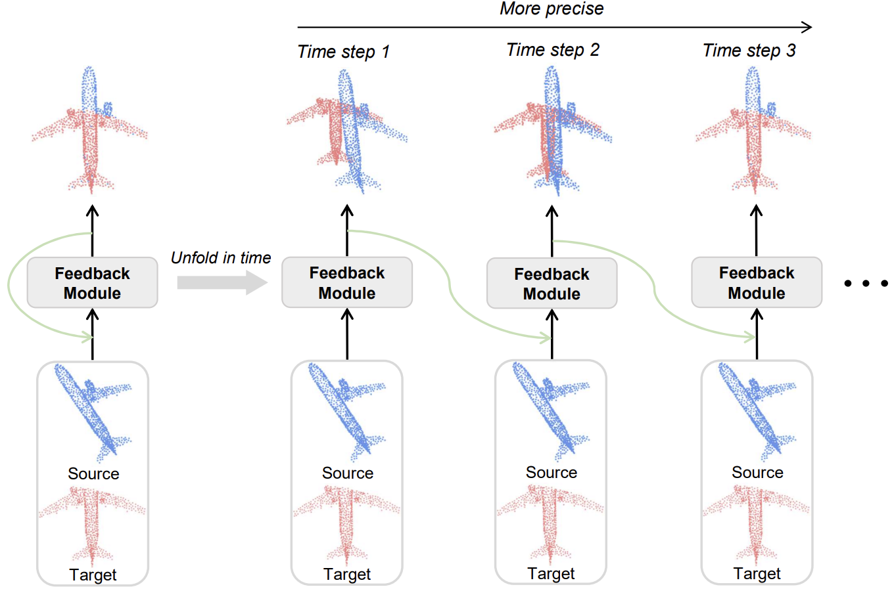
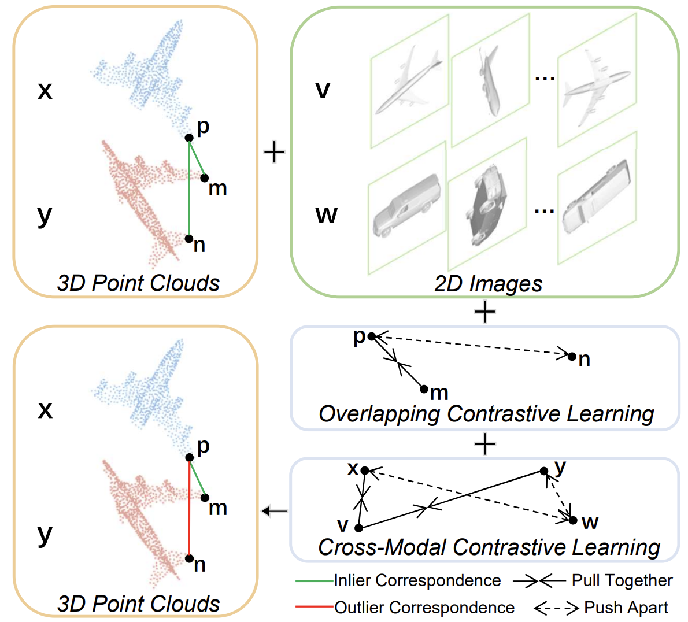

# About Me

<!--  -->

Here is **Yifan Xie (Ivan, 谢奕凡)**. 

 

I am currently a Ph.D. student in Data Science and Information Technology at [Tsinghua University](https://www.tsinghua.edu.cn/en/), co-advised by Prof. [Wenbo Ding](https://ssr-group.net/index.html) and Prof. [Fuchun Sun](https://www.cs.tsinghua.edu.cn/csen/info/1312/4393.htm). 
Previously, I obtained my Master's degree in Software Engineering from [Xi'an Jiaotong University](https://en.xjtu.edu.cn/) in 2025.
I am now a research intern at [Meituan Academy of Robotics Shenzhen, Meituan](https://mri.meituan.com/research/home).

 

My research focuses on **Robotic Manipulation, Tactile Perception and 3D Vision.**
Feel free to reach out for collaboration and discussion of research ideas (Email: ivanxie416[at]gmail.com).

<!-- ---

## Research Interests

- Robotic Manipulation
- Tactile Perception
- 3D Vision
- Affective Computing -->

---

## News and Updates

- **[2025.09]** Our paper **Universal Visuo-Tactile Video Understanding for Embodied Interaction** is accepted by **[NeurIPS 2025](https://neurips.cc/)** (CCF-A).
- **[2025.06]** Two papers are accepted by **[IROS 2025](https://iros25.org/)**.
- **[2025.06]** I begin my internship at **[X Square Robot](https://www.x2robot.com/)**.
- **[2025.06]** My master's thesis is awarded as the **Outstanding Master's Thesis of Xi'an Jiaotong University**.
- **[2025.06]** I obtain my master's degree from **Xi'an Jiaotong University**.
- **[2025.05]** Our paper **A Review of Human Emotion Synthesis Based on Generative Technology** is accepted by **[IEEE Transactions on Affective Computing](https://xplorestaging.ieee.org/xpl/RecentIssue.jsp?punumber=5165369)** (IF=9.6).
- **[2024.12]** Our paper **PointTalk: Audio-Driven Dynamic Lip Point Cloud for 3D Gaussian-based Talking Head Synthesis** is accepted by **[AAAI 2025](https://aaai.org/conference/aaai/aaai-25/)** (CCF-A).
- **[2024.10]** Our paper **Generative Technology for Human Emotion Recognition: A Scoping Review** is accepted by **[Information Fusion](https://www.sciencedirect.com/journal/information-fusion)** (IF=14.8).

 

---

## Selected Publications and Preprints

  

    
NeurIPS

    
  

  

    <h3>Universal Visuo-Tactile Video Understanding for Embodied Interaction</h3>
    
<strong>Yifan Xie</strong>, Mingyang Li, Shoujie Li, Xingting Li, Guangyu Chen, Fei Ma, Fei Richard Yu, Wenbo Ding

    
The Thirty-Ninth Annual Conference on Neural Information Processing Systems (NeurIPS), 2025

    

      <a href="https://arxiv.org/pdf/2505.22566">Paper</a>
      <a href="https://github.com/IvanXie416/VTV-LLM">Code</a>
    

  

  

    
AAAI

    
  

  

    <h3>PointTalk: Audio-Driven Dynamic Lip Point Cloud for 3D Gaussian-based Talking Head Synthesis</h3>
    
<strong>Yifan Xie</strong>, Tao Feng, Xin Zhang, Xiangyang Luo, Zixuan Guo, Weijiang Yu, Heng Chang, Fei Ma, Fei Richard Yu

    
AAAI Conference on Artificial Intelligence (AAAI), 2025

    

      <a href="https://arxiv.org/pdf/2412.08504">Paper</a>
      <a href="https://github.com/IvanXie416">Code</a>
    

  

  

    
IEEE TGRS

    
  

  

    <h3>HECPG: HECPG: Hyperbolic Embedding and Confident Patch-Guided Network for Point Cloud Matching</h3>
    
<strong>Yifan Xie</strong>, Jihua Zhu, Shiqi Li, Naiwen Hu, Pengcheng Shi

    
IEEE Transactions on Geoscience and Remote Sensing (TGRS), 2024

    

      <a href="https://ieeexplore.ieee.org/abstract/document/10445523">Paper</a>
      <a href="https://github.com/IvanXie416/HECPG">Code</a>
    

  

  

    
IEEE RA-L

    
  

  

    <h3>Iterative Feedback Network for Unsupervised Point Cloud Registration</h3>
    
<strong>Yifan Xie</strong>, Boyu Wang, Shiqi Li, Jihua Zhu

    
IEEE Robotics and Automation Letters (RA-L), 2024

    

      <a href="https://ieeexplore.ieee.org/abstract/document/10404064">Paper</a>
      <a href="https://github.com/IvanXie416/IFNet">Code</a>
    

  

  

    
IEEE RA-L

    
  

  

    <h3>Cross-Modal Information-Guided Network Using Contrastive Learning for Point Cloud Registration</h3>
    
<strong>Yifan Xie</strong>, Jihua Zhu, Shiqi Li, Pengcheng Shi

    
IEEE Robotics and Automation Letters (RA-L), 2024

    

      <a href="https://ieeexplore.ieee.org/abstract/document/10313937">Paper</a>
      <a href="https://github.com/IvanXie416/CMIGNet">Code</a>
    

  

